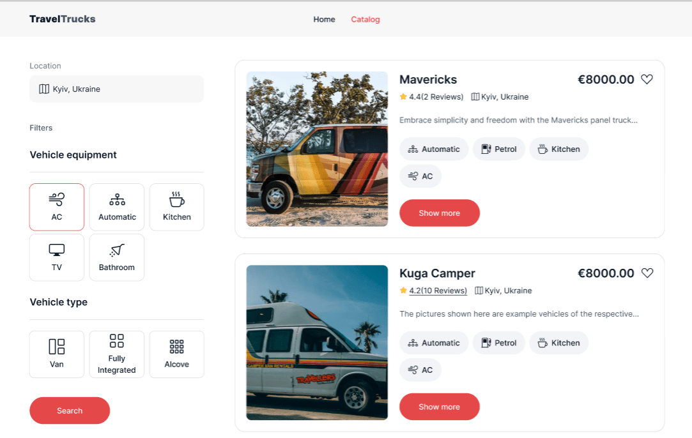
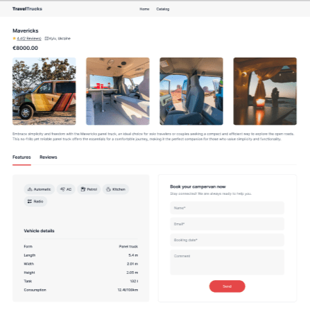

🚐 Travel Tracks

💼Project Overview:
The goal of the project is to create the front-end part of a web application for the company "TravelTrucks", which rents campers.

Tech Stack:

⚡Vite — fast development and optimized builds.
⚛️React — for building dynamic user interfaces.
🌍React Router — to manage navigation across pages.
🎯Redux Toolkit — for state management for better performance and scalability.
📅 React Datepicker — intuitive date selection for bookings.
🖌️CSS Modules — scoped styling for better maintainability.

🎯How to Use:

You are taken to the home page.
Go to the vehicle catalog page.
Browse campers: use our filters to search for campers by location and options.
Select the camper you want, select your booking dates, and confirm your rental.
Leave a review and rating.

📷 Screenshot:

### Home Page

### Catalog Page

### Camper Details

👤Author:

Developed by Myroslava Havrylchuk
GitHub: Myrosya-fsd
